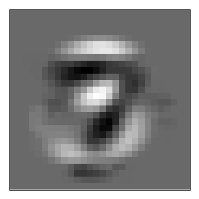
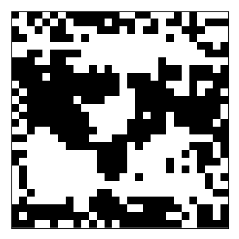
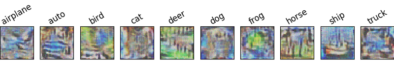
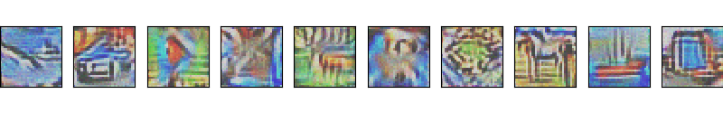
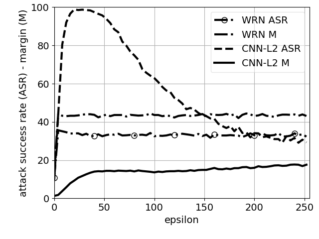
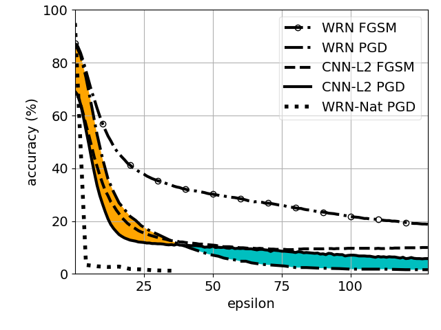
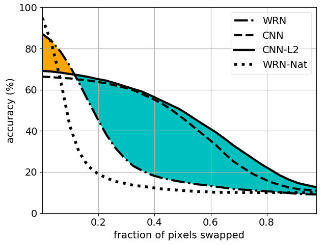
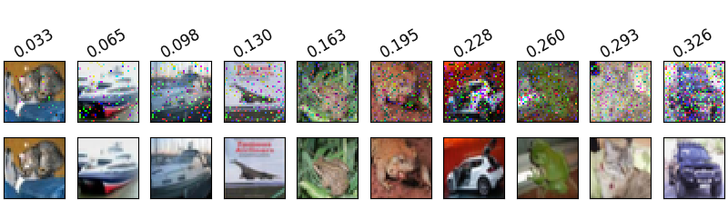
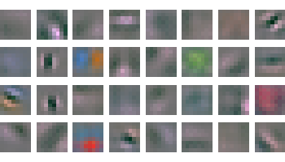
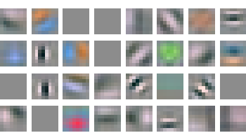

Source for "Adversarial Training Versus Weight Decay"
===================================

Instructions for reproducing all claims and figures in the paper are provided here by order of appearance. Command line arguments enclosed in [square brackets] are optional. We usually set the random seed with `tf.set_random_seed(0)`, so numbers should be exactly as shown in most cases.

## Section 3 - Robust Logistic Regression

> By simply using this initialization, we obtain a 39% absolute percentage improvement over the baseline, but the model underfits with ≈ 5.2% error on the clean test set.

Steps:

```
cd logistic
python logistic.py --expert [--gpu X]
```

Console output:

```
Clean test accuracy 0.9485
FGSM test accuracy for eps 0.25 = 0.3960
0.9485
0.3960
4.9219 <- Mean squared distance
```

> Figure 1 a) weight visualization

Steps:

`python logistic.py --restore ./ckpt/expert_l2_model.ckpt-10000 --show_weights [--gpu X]`

<p align="center">
  
</p>

Console output:

```
Restored model
Clean test accuracy 0.9603
FGSM test accuracy for eps 0.25 = 0.4087
0.9603
0.4087
4.5719
```

> Figure 1 b) binary weight visualization

Steps:

`python logistic.py --restore ./ckpt/binarized_model.ckpt-49999 --bits 1 --show_weights [--gpu X]`

<p align="center">
  
</p>

Console output:

```
Restored model
Clean test accuracy 0.9696
FGSM test accuracy for eps 0.25 = 0.0000
0.9696
0.0000
5.3085
```

Yes, the linear model with _binarized_ weights gets 96.8% clean test accuracy, 
but is easily perturbed with fgsm. To train an equivalent binarized model 
from scratch named "binary" to be saved in the './ckpt' dir, run:

`python logistic.py --bits 1 --train --max_steps 50000 --log_dir ./ckpt --name binary [--gpu X]`

Console output:

```
...(truncated)...
step 49800, logits_l1=7.892, w_l1=0.212, loss=0.009, loss_sp=4.773, test acc. 0.9676 (40582.9 ex/s)
step 49900, logits_l1=8.234, w_l1=0.213, loss=0.007, loss_sp=5.029, test acc. 0.9676 (21057.9 ex/s)
Clean test accuracy 0.9696
FGSM test accuracy for eps 0.25 = 0.0000
0.9696
0.0000
5.3085
```

> For example, training from scratch for 50k steps with λ = 3.25 maintains the ≈ 4% test error of the Expert-L2 model, while achieving 43% and 64% FGSM error rates for L1 and L2 weight decay respectively

Same as above, using `--l1` and `--l2` flags. E.g.,

`python logistic.py --l1 3.25 --train --show_weights --max_steps 50000 [--gpu X]`

Console output:

```
...(truncated)...
step 49800, logits_l1=4.141, w_l1=0.022, loss=0.121, loss_sp=2.687, test acc. 0.9642 (62116.3 ex/s)
step 49900, logits_l1=4.396, w_l1=0.022, loss=0.109, loss_sp=2.719, test acc. 0.9642 (31427.2 ex/s)
Clean test accuracy 0.9642
FGSM test accuracy for eps 0.25 = 0.5805
0.9642
0.5805
5.3011
```

Some variance is expected here, e.g. the above corresponds to 42% error vs 43% in the paper for 3.25 L1. 
For L2 weight decay, the error should be repeatable to the tenth of a percentage range.

```
Clean test accuracy 0.9603
FGSM test accuracy for eps 0.25 = 0.3572
0.9603
0.3572
5.1134
```

> Figure 2 a) `'fast_grad'` perturbation, b)--g) candidate adversarial examples, and 58.9% error rate.

Steps:

`python logistic.py --gpu 1 --restore ./ckpt/expert_l2_model.ckpt-10000 --show_examples --attack 'fast_grad' [--gpu X]`

<p align="center">
  
  
  
  
</p>

Console output:

```
Clean test accuracy 0.9603
FGSM test accuracy for eps 0.25 = 0.4107
0.9603
0.4107
3.9952
Label 0, prediction 0.0000
...(truncated)...
```

## Section 4 - Adversarial Training Versus Weight
Decay for Linear Models

### Section 4.2 - Experiments

> Figure 6 FGSM adversarial training

Steps a):

`python logistic.py --adv --train --show_weights --max_steps 10000 [--gpu X]`

Steps f):

`python logistic.py --adv --eps 0.5 --train --show_weights --max_steps 50000 [--gpu X]`


> Figure 7 a) L_0 counting "norm" attack

`python logistic.py --restore ./ckpt/expert_l2_model.ckpt-10000 --n_px 50 [--gpu X]`

Console output:

```
Restored model
Clean test accuracy 0.9603
0.9603, 0.9667
0.9603, 0.9638
0.9603, 0.9607
0.9598, 0.9571
0.9578, 0.9525
0.9549, 0.9474
...(truncated)...
0.4956, 0.9725
```

> Figure 7 b) L_\infty attack

`python logistic.py --restore ./ckpt/expert_l2_model.ckpt-10000 --sweep [--gpu X]`

Console output:

```
Restored model
Clean test accuracy 0.9603
epsilon, accuracy, mse
0.05, 0.9313, 0.9328
0.06, 0.9254, 1.1027
0.07, 0.9132, 1.2723
0.08, 0.8994, 1.4417
0.09, 0.8867, 1.6107
...(truncated)...
0.50, 0.0000, 8.9671
```

Repeat for models trained naturally `natural_model.ckpt-49999` and with 0.25-FGSM `adv_trained_model.ckpt-49999`.

## Section 6 - CIFAR-10 Experiments

To use the Madry et al. (2018) WideResNet, you will first need to set your own local `config.json` and fetch the pre-trained models using the `fetch_model.py` script provided here: `https://github.com/MadryLab/cifar10_challenge`

### Section 6.1 - Fooling images

> Figure 8 a) Fooling image examples

```
cd ../cifar10
python cifar10_fooling_images.py --model_path './ckpt/cnn-model' --annot [--gpu X]
```

<p align="center">
  
</p>

> Figure 8 b) fooling images

`python cifar10_fooling_images.py [--gpu X]`

<p align="center">
  
</p>

> Figure 9 FGSM fooling images ASR and Margin

<p align="center">
  
</p>

### Section 6.2 - L_\infty attacks

> Figure 10 White-box L_\infty PGD attacks

<p align="center">
  
</p>

### Section 6.3 - L_0 counting "norm" attacks

#### Section 6.3.1 - Pixel Swapping

> Figure 11 L_0 counting "norm" black-box pixel swapping attack

<p align="center">
  
</p>

> Figure 12 CIFAR-10 samples with swapped pixels

```
cd cifar10/MadryLab
python disp_rand.py
```

<p align="center">
  
</p>

#### Section 6.3.2 - Jacobian-based Saliency Map Attack

### Section 6.4 - Discussion

> Figure 13 a)--b) Visualization of filters from `conv1` layer

<p align="center">
  
  
</p>


Citation
======================

Bibtex:  
```
@article{galloway2018adversarial,  
  title={Adversarial Training Versus Weight Decay},  
  author={Galloway, Angus and Tanay, Thomas and Taylor, Graham W},  
  journal={arXiv preprint arXiv:1804.03308},  
  year={2018}  
}
```
